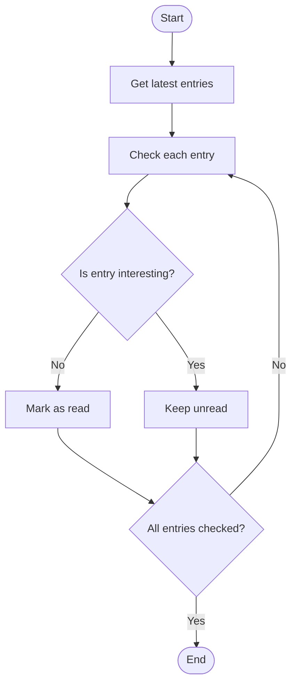

# Feedly MCP

A MCP for Feedly.

Core functionality:
- Get the latest entries from a category.
- Mark an entry as read.

## Workflow

```mermaid
flowchart TD
  A([Start]) --> B[Get latest entries]
  B --> C[Check each entry]
  C --> D{Is entry interesting?}
  D -->|No| E[Mark as read]
  D -->|Yes| F[Keep unread]
  E --> G{All entries checked?}
  F --> G
  G -->|Yes| H([End])
  G -->|No| C
```

